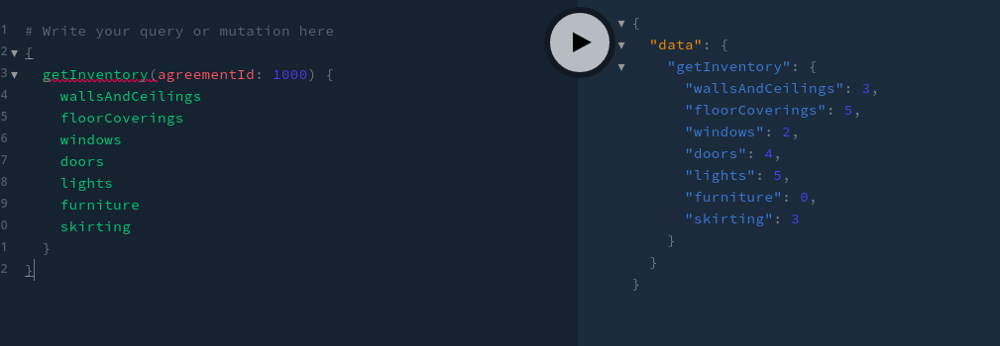
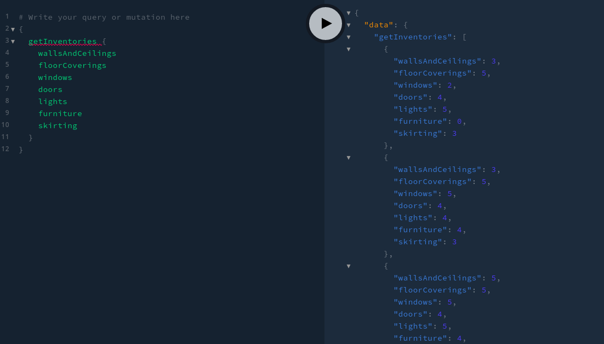

# Rentancy ~ Inventory GraphQL Explorer

Simple Spring boot GraphQL implementation

### Stack

1. Java 11
2. Spring boot
3. Maven

### Usage

#### Build source and run tests

`mvn clean install`

#### Run application

`mvn spring-boot:run` 

#### Play with it

Make request on `http://localhost:8080/graphql`

You can use `GraphQL playground` to make requests:  
https://github.com/prisma-labs/graphql-playground

### Example queries

### Resources used

GraphQL Java: https://www.graphql-java.com/     
GraphQL: https://graphql.org/
